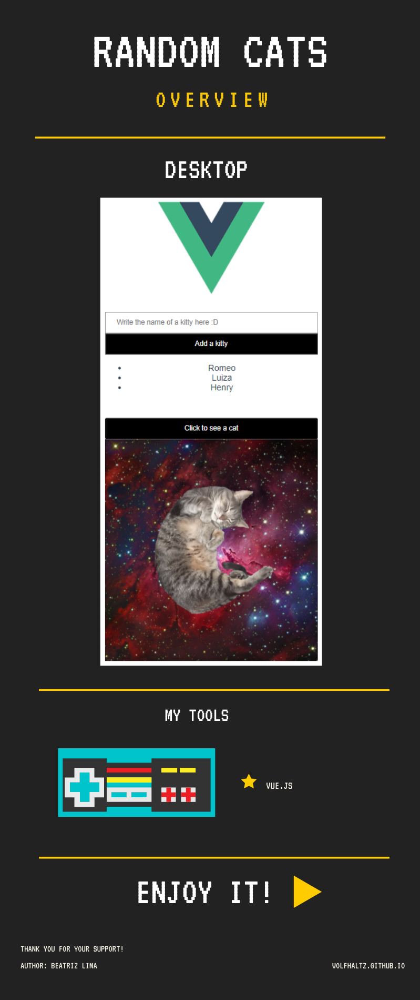

# Random cats
## This project shows random cats

Check the [STATUS OF THE PROJECT](#STATUS OF THE PROJECT)

## Project setup
```
npm install
```

### Compiles and hot-reloads for development
```
npm run serve
```

#### Thank you for your support!




# STATUS OF THE PROJECT:

It's working but needs improvements at front-end ^-^